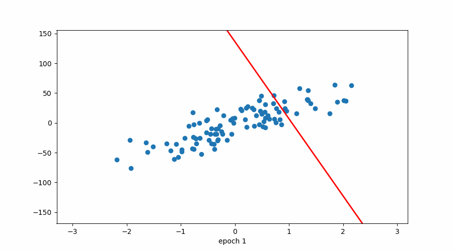
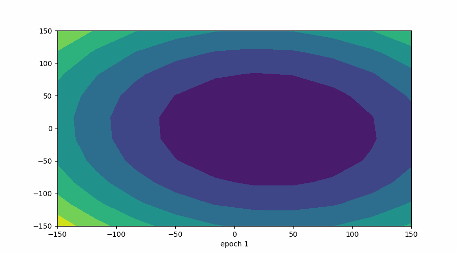
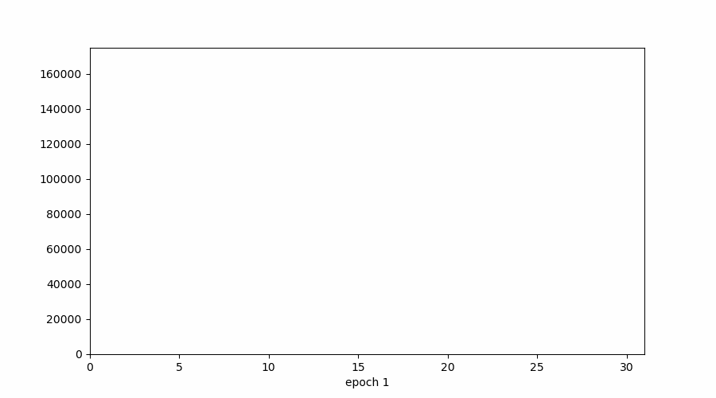

## 📊 Visualizations for Stochastic Gradient Descent (SGD)

#### 1️⃣ Line Plot (Model Updates)
> **Important:** X-axis is **number of updates**, NOT epochs.

- Model is trained for **only 1 epoch**
- Count goes till **100** because:
  - Dataset has 100 rows
  - SGD updates parameters **once per row**
- So → **100 updates in 1 epoch**

🔹 Key Insight:
- In SGD, **every update does NOT have to improve the model**
- It is possible that:
  - Update (n + 1) is worse than update (n)
- Due to randomness, the path is noisy
- But **overall trend moves toward the optimum**

👉 In contrast, **Batch GD improves loss every epoch** (smooth descent).

#### 2️⃣ Contour Plot (Loss Surface)

- Shows movement over the **cost function surface**
- Path is **zig-zag**, not smooth
- Due to random row selection
- Still moves toward the global minimum over time

#### 3️⃣ Cost Plot

- Cost does **not decrease monotonically**
- High variance in loss values
- But overall trend is **downward**

👉 This noisy behavior is **expected and normal** in SGD.