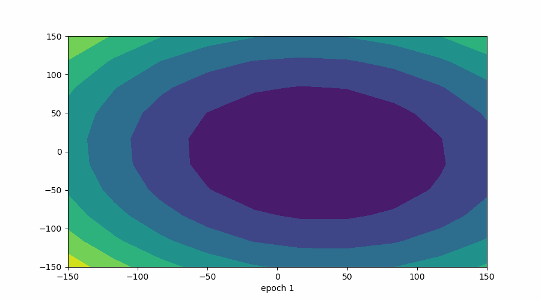

# Mini-Batch Gradient Descent

Mini-batch Gradient Descent is a **middle ground** between Batch GD and Stochastic GD.

## 🔹 Core Idea
- Instead of using:
  - **All rows** (Batch GD)
  - **One row** (SGD)
- We use a **small group of rows** called a **batch**

Example
- Total rows (n) = 1000  
- Batch size = 100  

Then:
- Total batches = 1000 / 100 = **10**
- Updates per epoch = **10**

👉 Each batch produces **one update** of parameters.

#### 🔹 How It Works
```
for each epoch:
split data into batches
for each batch:
compute gradient using batch
update parameters
```




