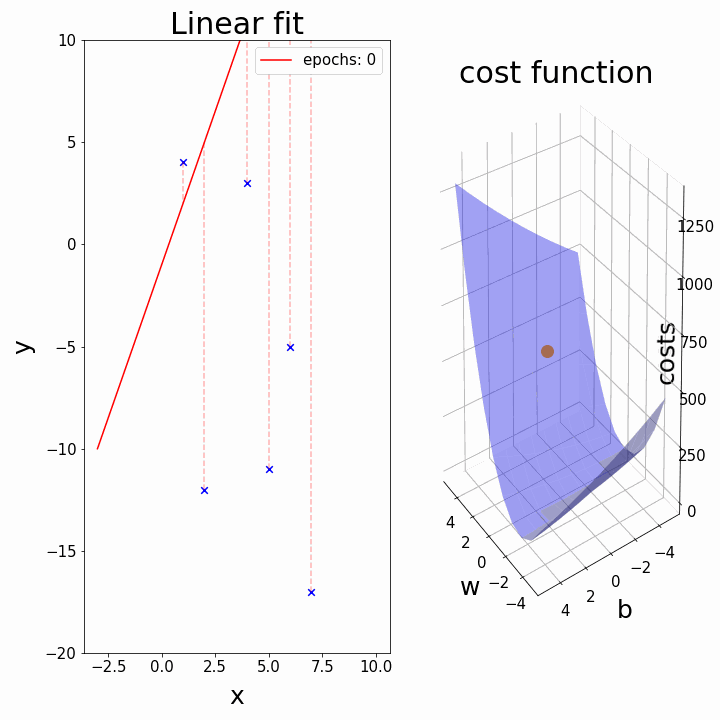

# Gradient Descent (GD)

Gradient Descent is a **first-order iterative optimization algorithm** used to find the **minimum** of a **differentiable function**.

#### 🔹 Core Idea
- At the current point, compute the **gradient** (slope) of the function  
- Move in the **opposite direction of the gradient**  
- This direction gives the **steepest descent**
- Repeat until the minimum is reached (or changes become very small)

👉 It is a **technique to find minima**, not a model.

##### 🔹 Where Gradient Descent is Used
- **Linear Regression**
- **Logistic Regression**
- **t-SNE** (dimensionality reduction / clustering-related)
- **Backbone of Deep Learning**
  - Neural networks cannot use closed-form solutions
  - GD (and its variants) is the only practical option

---

## Intuition

Gradient Descent can be applied to **any ML scenario**, but here we understand it using **Linear Regression**.

#### 🔹 Setup
Assume a small dataset:
- Input → CGPA (x)
- Output → LPA (y)
- 4 students → 4 data points

Linear Regression loss function:
```python
Loss = MSE = Σ (yi − ŷi)²
```

Where:
```python
ŷi = mxi + b
```

So loss depends on `m` and `b`:
```python
Loss(m, b) = Σ (yi − mxi − b)²
```

### 🔹 Fix m, Optimize b (For Understanding)

Assume:

m = 78.35

Now loss depends **only on b**:
```python
Loss(b) = Σ (yi − 78.35xi − b)²
```

This loss function becomes a **parabola** (U-shaped curve).


Goal:
> Find the value of `b` where **loss is minimum**.

### 🔹 Step 1 — Start with a Random Value
Choose a random starting point:

b = −10

Compute loss at this point.

### 🔹 Step 2 — How to Move b?
Question:
> Should we increase b or decrease b?

Answer:
👉 Look at the **slope** of the loss curve.

### 🔹 Step 3 — Use Slope (Gradient)
- Slope = derivative of loss w.r.t b
- Slope tells **direction of increase**

Rules:
- If slope is **positive** → move backward (decrease b)
- If slope is **negative** → move forward (increase b)

### 🔹 Step 4 — Update Rule


Naively:
```python
b_new = b_old − slope
```

❌ Problem:
- Very large jumps
- Zig-zag movement
- May overshoot minimum

### 🔹 Step 5 — Learning Rate
To control step size, introduce **learning rate (η)**:
```python
b_new = b_old − η × slope
```

> `η × slope` it is known as "step size"

- η is usually small (e.g., 0.01)
- Prevents drastic updates
- Makes movement smooth and gradual

### 🔹 Step 6 — Iterate
Repeat:
1. Compute slope at current b
2. Update b using learning rate
3. Move closer to minimum

This is done over **multiple iterations**.

### 🔹 When to Stop Gradient Descent?

1️. Convergence Condition

Stop if:
```
|b_new − b_old| < 0.0001
```

Means:
- Change is extremely small
- Further movement gives no benefit

If:
```
b_new − b_old = 0
```

→ fully converged

2️. Fixed Number of Iterations (Epochs)

Stop after:
- 100 iterations or 1000 iterations
(Used when convergence is slow or noisy)

# Mathematical Formulation (Finding `b`)

Assume slope is fixed:

m = 78.35

We want to find the **optimal value of `b`** that minimizes the loss.

### 🔹 Loss Function
For Linear Regression:
```
Loss = Σ(yi − ŷi)²
```

Where:
```
ŷi = mxi + b
```

So loss becomes:
```
Loss(b) = Σ(yi − mxi − b)²
```

Loss depends **only on `b`** now.


1. Step 1 — Initialize `b`
Start with a random value:

b = 0

Choose learning rate:
```
η = 0.01
```

Choose number of epochs (iterations).

2. Step 2 — Compute Slope (Gradient)
Take derivative of loss w.r.t `b`:
```
dL/db = −2 Σ(yi − mxi − b)
```

This gives the **slope at current `b`**.

3. Step 3 — Update Rule
```python
for i in epochs:
  bnew = bold - n*slope
```

Use Gradient Descent update:
```
b_new = b_old − η × slope
```

4. Step 4 — Iterative Process
For each iteration:

Iteration 0
```
b_old = 0
slope = −2 Σ (yi − mxi − b_old)
b_new = b_old − η × slope
```

Iteration 1
```
b_old = b_new
Compute slope again
Update b
```

Continue…

Repeat the process until:
- Maximum epochs reached, OR
- Change in `b` becomes very small (convergence)

---

# Effect of Learning Rate (η)

Gradient Descent is **highly sensitive** to the learning rate.

Learning rate controls **how big a step** the algorithm takes while moving toward the minimum.

Assume:
- Number of epochs = 10


1. Case 1: Very Low Learning Rate (η = 0.02)

2. Case 2: Appropriate Learning Rate (η = 0.1)

3. Case 3: Very High Learning Rate (η = 0.5)

#### 🔹 How to Choose Learning Rate?
- There is **no fixed value**
- It depends on:
  - Dataset
  - Feature scaling

👉 Learning rate is a **hyperparameter**

---

## Universality of Gradient Descent

To update any parameter, Gradient Descent only needs **one thing**:
> The **slope (gradient)** of the loss function w.r.t that parameter.

If the **loss function is differentiable**, GD can optimize it.

#### 🔹 Why Model Type Doesn’t Matter
- Linear Regression → MSE loss  
- Logistic Regression → Log loss  
- Neural Networks → Cross-entropy / other losses  

The **loss function changes**, but the **update rule remains the same**:
```python
parameter_new = parameter_old − η × gradient
```

Whether it is:
- Linear
- Logistic
- Deep Learning

GD only cares about:
- Differentiability of the loss function
- Gradient value

## 🔹 Example
In Linear Regression:
```python
b_new = b_old − η × (dL/db)
```

In Logistic Regression or Deep Learning:
```python
θ_new = θ_old − η × (dL/dθ)
```

Same rule. Different loss.

---

 # Adding `m` into the Mix (Optimizing both `m` and `b`)

Earlier, we optimized only **b** by keeping **m constant**.  
Now, we will **optimize both parameters together**.

This is the real Gradient Descent used in Linear Regression.

### 🔹 Step 1 — Initialize Parameters
Initialisation random values for m and b

Let's say:
m = 1, b = 0

### 🔹 Step 2 — Set Hyperparameters
decide no. of epochs and learning rate

Let's say:
epochs = 100
learning rate (η) = 0.01

### 🔹 Step 3 — Loss Function
For Linear Regression:
```
ŷᵢ = m xᵢ + b
```

Loss (MSE without 1/n for simplicity):
```
L = Σ (yᵢ − ŷᵢ)²
= Σ (yᵢ − m xᵢ − b)²
```

So:
```
L = L(m, b)
```

Loss now depends on **two variables**.
```python
for i in epochs:
  b = b - nslope
  m = m - nslope
```


### 🔹 Loss Surface (3D View)
- X-axis → `m`
- Y-axis → `b`
- Z-axis → loss

The surface is a **3D paraboloid (bowl-shaped)**.


There is **one global minimum**.

### 🔹 Gradient (Important Terminology)
We don’t say “differentiation” here — we say **gradient**.

Why?
- Updating `b` → take partial derivative w.r.t `b`
- Updating `m` → take partial derivative w.r.t `m`

These together form the **gradient vector**.

#### 🔹 Slopes (Partial Derivatives)

- Gradient w.r.t `b`
```
∂L/∂b = −2 Σ (yᵢ − m xᵢ − b)
```
shell

-  Gradient w.r.t `m`
```
∂L/∂m = −2 Σ xᵢ (yᵢ − m xᵢ − b)
```

These tell us **how to move m and b** to reduce loss.


#### 🔹 Update Rules (Core GD Step)

For each epoch:
```
b = b − η × (∂L/∂b)
m = m − η × (∂L/∂m)
```

Both parameters are updated **simultaneously**.

Over iterations:
- Large corrections at start
- Small fine-tuning near minimum
- Eventually converges

---

## Effect of Loss Function on Gradient Descent

- Convex Loss Function

Example:
```
L = Σ (yᵢ − ŷᵢ)²
```

- This loss function is **convex**
- Convex ⇒ **only one minimum**
- That minimum is the **global minimum**

👉 Gradient Descent is guaranteed to converge to the correct solution.

### 🔹 Non-Convex Loss Function
- May have **multiple minima**
- Can have **local minima**
- Can have **saddle points**
- Can have **flat regions (plateaus)**


In such cases:
- GD may get stuck in a local minimum
- GD may stop at a saddle point
- GD may slow down drastically in flat regions


#### 🔹 Saddle Point Problem
- Gradient becomes almost zero
- GD thinks it has converged
- But it is **not at the minimum**


This is common in **high-dimensional spaces**, especially in deep learning.

- If epochs are **too few**, GD may stop **before reaching the true minimum**
- More epochs allow:
  - Better exploration
  - Proper convergence

But too many epochs can waste computation.

---

## Effect of Data on Gradient Descent

If data is **not scaled properly**: (right image)
- Loss surface becomes **elongated**
- GD takes a **zig-zag path**
- Convergence becomes **slow**

If data **is scaled**: (left image)
- Loss surface becomes **more circular**
- GD moves **directly toward the minimum**
- Faster convergence


👉 Feature scaling is **critical** for efficient Gradient Descent.

---

