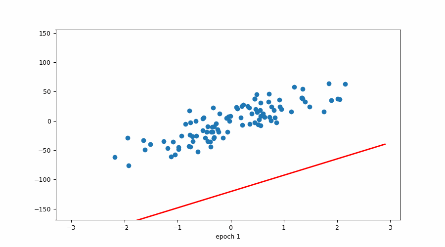
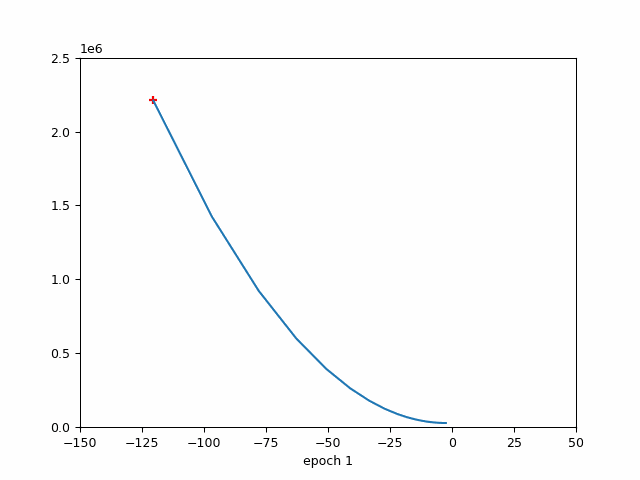
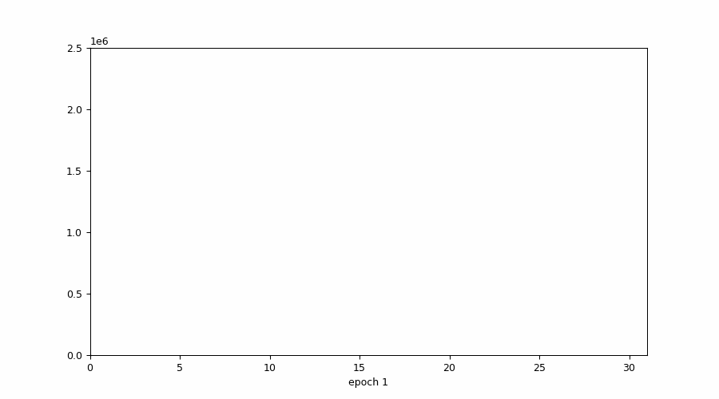
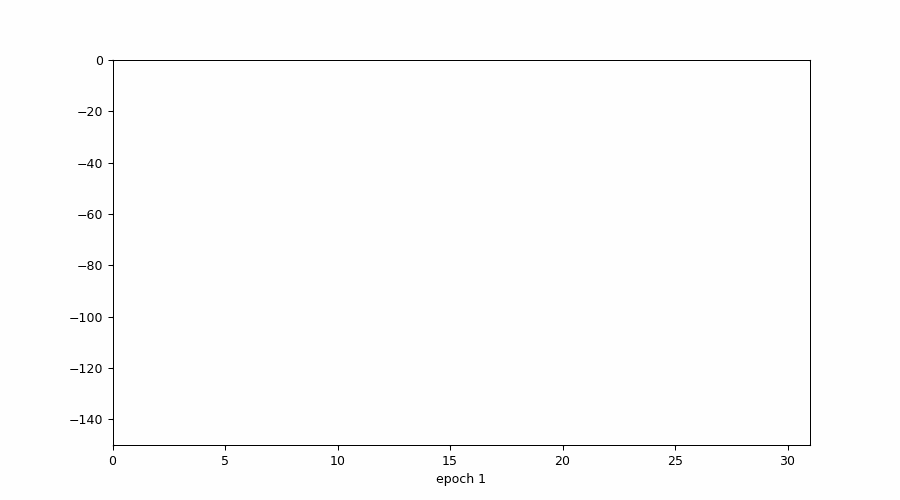
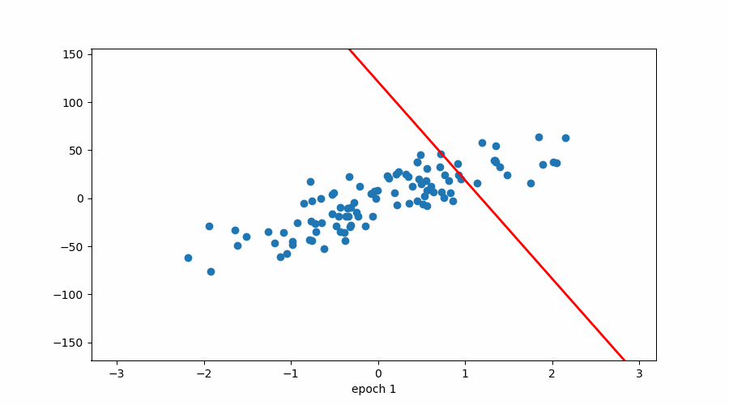
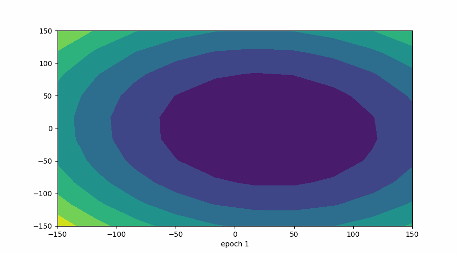
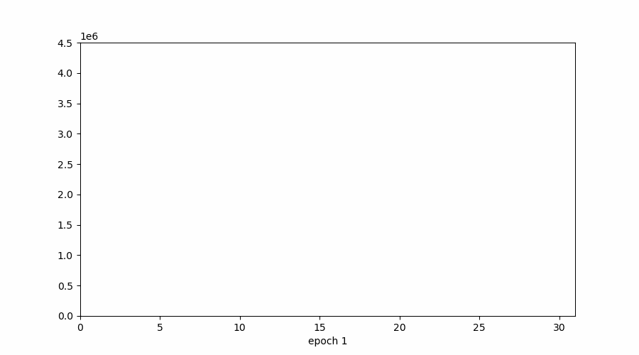
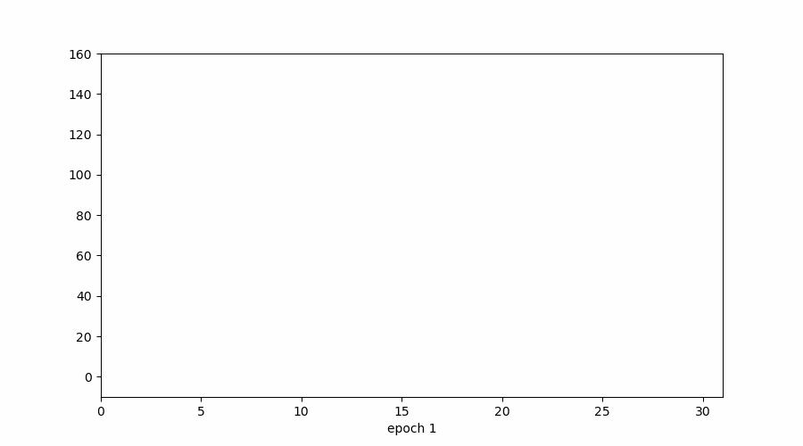
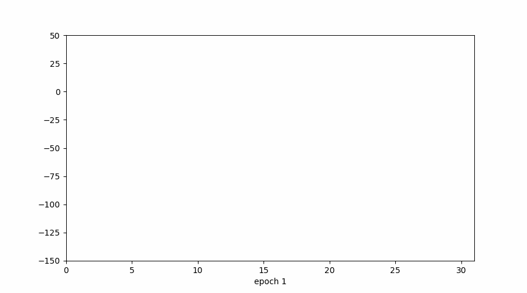

## Visualizations for Gradient Descent

### (for b only)

#### 1. How Gradient Descent Converges towards a solution

#### 2. Parameter (b) vs Cost
- **X-axis** → value of `b`
- **Y-axis** → cost / loss (not slope)

- Initially: large jumps (far from minimum)
- Later: smaller and smaller updates
- Shows why learning rate matters

#### 3. Cost vs Epoch (It tells When to Stop)
- **X-axis** → epochs (iterations)
- **Y-axis** → cost / loss

- At start: loss is very high
- With more epochs: loss decreases
- When curve becomes **flat** → convergence achieved → stop training

#### 4. Epoch vs Parameter Value
- **X-axis** → epochs
- **Y-axis** → value of `b`

- Parameter changes rapidly at first
- Gradually stabilizes
- Final flat region indicates optimal `b`

### (for both m and b)

#### 5. Convergence to Best Fit Line

Shows how Gradient Descent starts from a **wrong line** and gradually moves toward the **optimal regression line**.

#### 6. Contour Plot (Loss Surface)

- **X-axis** → slope (`m`)
- **Y-axis** → intercept (`b`)

- **Darker regions** → lower loss (deeper)

- GD follows the path of steepest descent  
- Converges toward the darkest region (global minimum)

#### 7. Cost vs Epoch

- **X-axis** → epochs
- **Y-axis** → cost / loss

#### 8. Intercept (`b`) vs Epoch

- **X-axis** → epochs
- **Y-axis** → value of `b`

#### 9. Slope (`m`) vs Epoch

- **X-axis** → epochs
- **Y-axis** → value of `m`

